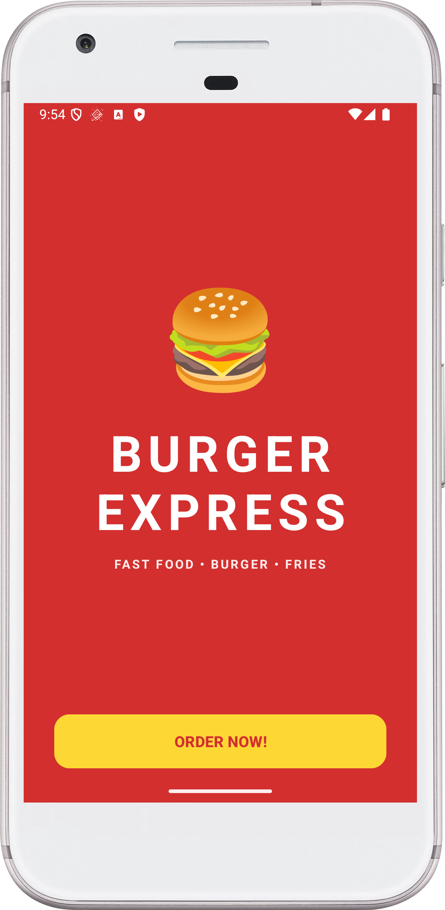
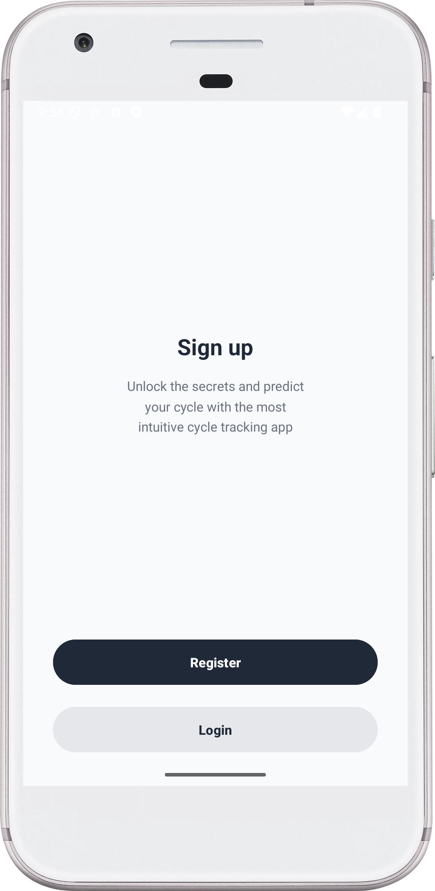
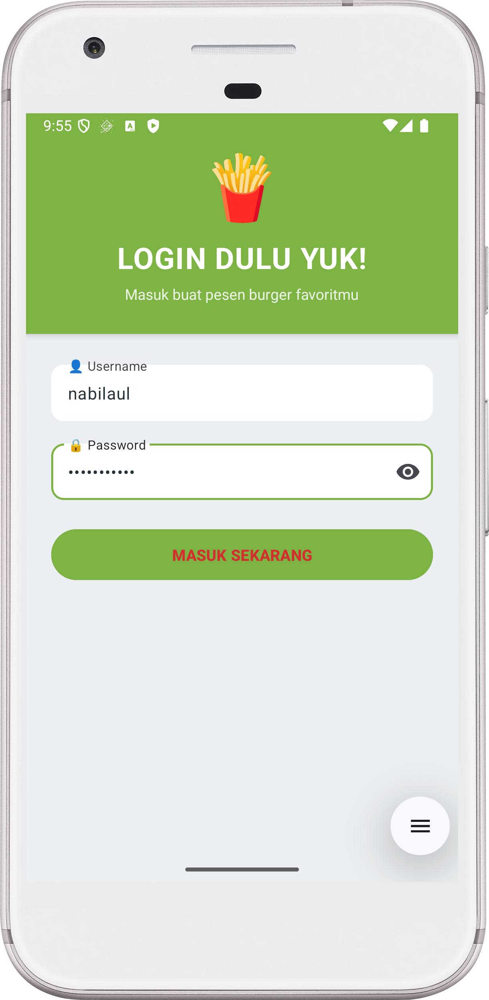
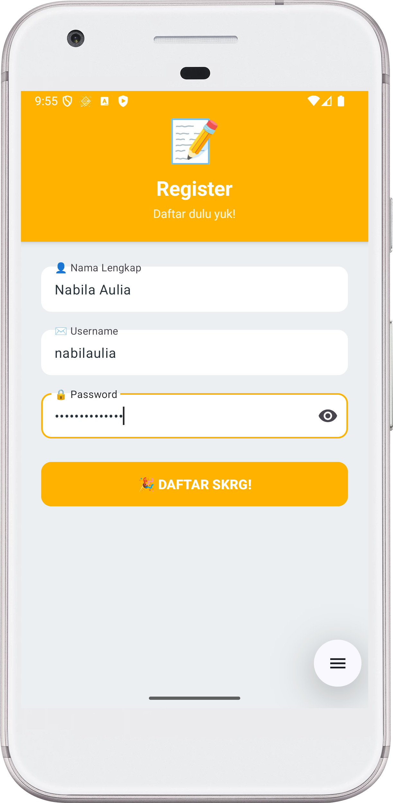
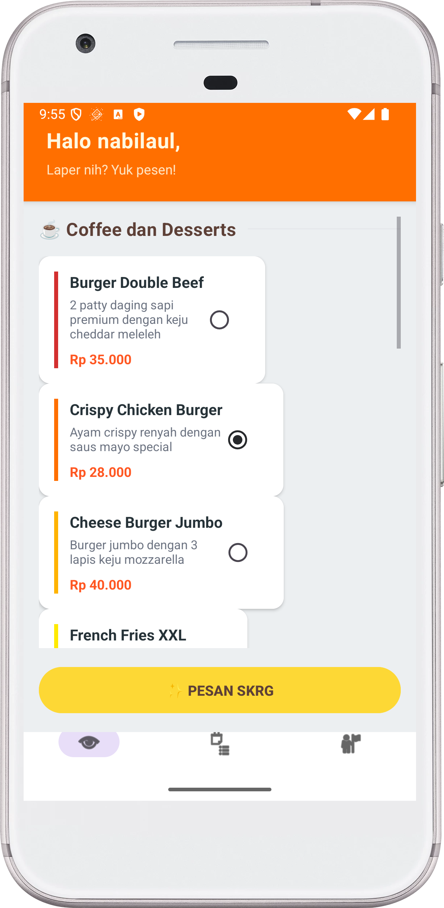
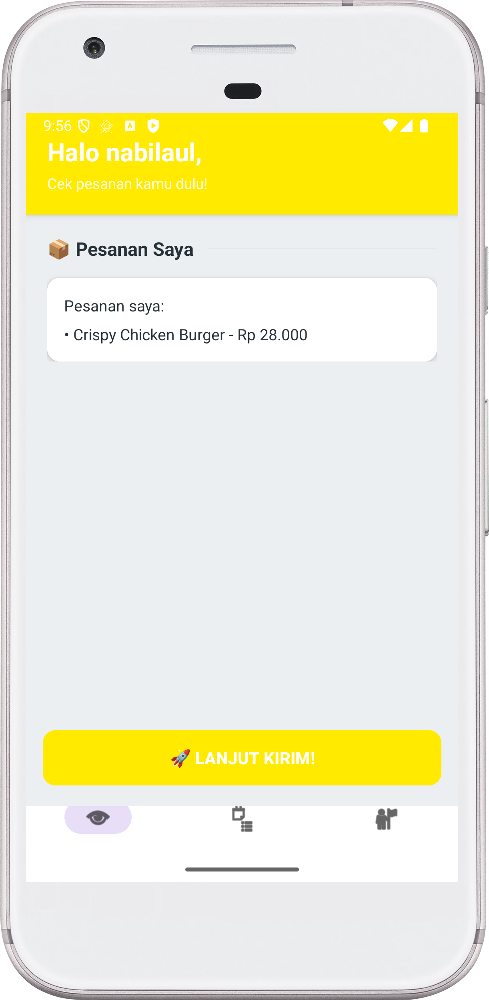
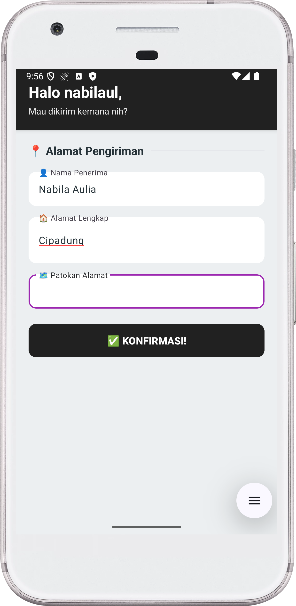

# 🍔 BURGER EXPRESS - Fast Food & Burger App

Aplikasi Android untuk memesan burger dan fast food favorit dengan desain yang bold, playful, dan penuh warna! Dibangun menggunakan Kotlin dan View Binding.

## 📱 Tentang Aplikasi

**Burger Express** adalah aplikasi mobile yang memudahkan pengguna untuk memesan berbagai jenis burger, kentang goreng, dan fast food lainnya dengan tampilan yang menarik dan user-friendly. Aplikasi ini menampilkan 12 menu item dengan informasi lengkap termasuk nama, deskripsi, dan harga.

## ✨ Fitur Utama

- ✅ **Autentikasi User** - Login dan Register
- ✅ **12 Menu Fast Food** - Burger, fries, chicken wings, dan lainnya
- ✅ **Review Pesanan** - Lihat detail pesanan sebelum checkout
- ✅ **Input Alamat** - Form alamat pengiriman lengkap
- ✅ **Konfirmasi Order** - Notifikasi sukses setelah order
- ✅ **Bottom Navigation** - Navigasi mudah antar halaman
- ✅ **Desain Bold & Playful** - UI/UX yang energik dengan warna cerah
- ✅ **Material Design** - Menggunakan Material Components

## 📸 Screenshot Aplikasi

Berikut dokumentasi aplikasi yang berhasil dijalankan:

### 1. Splash Screen

- Background merah burger dengan emoji burger 🍔
- Judul "BURGER EXPRESS" dengan typography bold
- Tombol "ORDER NOW!" dengan warna mustard yellow
- **Gaya Desain**: Bold & Energik dengan letter spacing lebar

### 2. Auth Choice

- Pilihan untuk Register atau Login
- Deskripsi singkat aplikasi
- Tombol berbeda warna untuk setiap pilihan

### 3. Login

- Header hijau lettuce dengan emoji kentang 🍟
- Judul "LOGIN DULU YUK!" dengan typography playful
- Form login dengan username dan password
- Material TextInputLayout dengan ikon
- Password toggle untuk show/hide password
- Tombol "MASUK SEKARANG" dengan warna hijau
- **Perbedaan Desain**: Teks putih pada background warna, uppercase title

### 4. Register

- Header cheese gold dengan emoji 📝
- Subtitle "Daftar dulu yuk!"
- Form registrasi lengkap (Nama, Username, Password)
- Material Design Components
- Tombol "DAFTAR SKRG!" dengan warna cheese gold
- **Perbedaan Desain**: Bahasa casual & friendly

### 5. Home - Menu List

- Header ketchup orange dengan greeting casual
- Subtitle "Laper nih? Yuk pesen!"
- Section title "🍔 BURGER MENU"
- 12 menu item fast food dalam card menarik:
  - Burger Double Beef - Rp 35.000
  - Crispy Chicken Burger - Rp 28.000
  - Cheese Burger Jumbo - Rp 40.000
  - French Fries XXL - Rp 20.000
  - Chicken Wings 8pcs - Rp 32.000
  - Onion Rings Special - Rp 18.000
  - Hot Dog Supreme - Rp 25.000
  - Veggie Burger - Rp 24.000
  - Chicken Nuggets 12pcs - Rp 30.000
  - BBQ Beef Burger - Rp 38.000
  - Spicy Chicken Wrap - Rp 27.000
  - Fish Fillet Burger - Rp 33.000
- Setiap card menampilkan nama, deskripsi, harga, dan indikator warna
- RadioButton terintegrasi dalam card
- Bottom Navigation Bar (Home, Order, Profile)
- **Perbedaan Desain**: Tombol "🔥 PESAN SKRG" dengan warna mustard yellow cerah

### 6. Order Review

- Header fries yellow dengan informasi user
- Subtitle "Cek pesanan kamu dulu!"
- Card putih menampilkan pesanan yang dipilih
- Tombol "LANJUT KIRIM!" dengan warna kuning
- Bottom Navigation Bar
- **Perbedaan UX**: Bahasa casual & energik, teks uppercase pada button

### 7. Delivery Address

- Header cola black dengan greeting personal
- Subtitle "Mau dikirim kemana nih?"
- Form input alamat lengkap:
  - 👤 Nama Penerima
  - 🏠 Alamat Lengkap
  - 🗺️ Patokan Alamat
- Material TextInputLayout dengan ikon
- Tombol "KONFIRMASI!" dengan warna hitam
- **Perbedaan Desain**: Dark background untuk kontras maksimal

> **Catatan**: Aplikasi telah dijalankan dengan sukses dan semua fitur telah diuji. Screenshot di atas adalah bukti bahwa aplikasi berjalan dengan baik.

## 🛠️ Teknologi yang Digunakan

- **Language**: Kotlin
- **SDK**: Android SDK (Min SDK 24, Target SDK 36)
- **Build Tool**: Gradle 8.13
- **Architecture Pattern**: MVVM (Model-View-ViewModel)
- **UI Components**:
  - View Binding
  - Material Design Components
  - ConstraintLayout
  - ScrollView
  - Material TextInputLayout
  - Material CardView
  - Bottom Navigation View

## 📁 Struktur Project

```
PraktikumWireframe/
├── app/
│   ├── src/
│   │   ├── main/
│   │   │   ├── java/com/example/praktikumwireframe/
│   │   │   │   ├── SplashActivity.kt          # Splash screen
│   │   │   │   ├── AuthChoiceActivity.kt      # Auth choice
│   │   │   │   ├── LoginActivity.kt           # Login
│   │   │   │   ├── RegisterActivity.kt        # Register
│   │   │   │   ├── HomeActivity.kt            # Menu list
│   │   │   │   ├── OrderReviewActivity.kt     # Order review
│   │   │   │   ├── AddressActivity.kt         # Address input
│   │   │   │   ├── ConfirmActivity.kt         # Confirmation
│   │   │   │   ├── FoodItem.kt                # Menu data class
│   │   │   │   └── OrderData.kt               # Order singleton
│   │   │   ├── res/
│   │   │   │   ├── layout/                    # Layout files
│   │   │   │   ├── values/
│   │   │   │   │   ├── colors.xml             # Color definitions
│   │   │   │   │   └── strings.xml
│   │   │   │   ├── menu/
│   │   │   │   │   └── menu_bottom.xml
│   │   │   │   └── drawable/
│   │   │   └── AndroidManifest.xml
│   │   └── build.gradle.kts
│   └── ...
├── screenshot/                                 # Screenshot folder (7 files)
│   ├── 01_splash.png
│   ├── 02_auth_choice.png
│   ├── 03_login.png
│   ├── 04_register.png
│   ├── 05_home.png
│   ├── 06_order_review.png
│   └── 07_address.png
└── README.md
```

## 🎨 Skema Warna

Aplikasi menggunakan skema warna yang bold dan playful untuk tema fast food:

- **Burger Red**: `#D32F2F` - Merah bold untuk header splash
- **Mustard Yellow**: `#FDD835` - Kuning cerah untuk button utama
- **Ketchup Orange**: `#FF6F00` - Orange vibrant untuk header home
- **Lettuce Green**: `#7CB342` - Hijau segar untuk login
- **Cheese Gold**: `#FFB300` - Gold untuk register
- **Cola Black**: `#212121` - Hitam bold untuk address
- **Fries Yellow**: `#FFEA00` - Kuning terang untuk order review

## 🎯 Filosofi Desain

### Fitur Unik Version 4:

1. **Typography yang Bold**
   - Letter spacing ekstra lebar (0.12-0.15)
   - `textAllCaps="true"` untuk kesan energik
   - Font size lebih besar untuk impact maksimal

2. **Button Design yang Loud**
   - Corner radius 16dp untuk kesan modern tapi playful
   - Height 64dp untuk mudah di-tap
   - Warna kontras tinggi (yellow on red)

3. **Color Psychology**
   - Merah untuk appetite stimulation
   - Kuning untuk happiness & energy
   - Orange untuk excitement
   - Hijau untuk freshness
   - Hitam untuk bold statement

4. **UX yang Casual & Friendly**
   - Bahasa Indonesia gaul & casual
   - Emoji banyak untuk fun vibe
   - Teks singkat & to-the-point
   - Uppercase untuk emphatic feel

5. **Kontras Tinggi**
   - Kombinasi warna bold yang eye-catching
   - Teks putih pada background gelap
   - Shadow dan elevation untuk depth

## 🚀 Cara Menjalankan

### Prerequisites
- Android Studio Arctic Fox atau lebih baru
- JDK 11 atau lebih tinggi
- Android SDK dengan API Level 24 atau lebih tinggi
- Android emulator atau physical device

### Langkah-langkah

1. **Clone Repository**
   ```bash
   git clone https://github.com/hilmanmaulana1237/UTS_HilmanMaulana_PAM.git
   cd PraktikumWireframe
   ```

2. **Buka di Android Studio**
   - Buka Android Studio
   - File → Open → Pilih folder project
   - Tunggu Gradle sync selesai

3. **Build Project**
   ```bash
   ./gradlew build
   ```
   atau melalui Android Studio: Build → Make Project

4. **Run Application**
   - Pilih device/emulator
   - Klik tombol Run (▶️) atau Shift+F10
   - Aplikasi akan terinstall dan berjalan

## 📦 Komponen Utama

### Data Classes

**FoodItem.kt**
```kotlin
data class FoodItem(
    val id: Int,
    val name: String,
    val description: String,
    val price: String,
    val colorRes: Int
)
```

**OrderData.kt** - Singleton untuk penyimpanan data order
```kotlin
object OrderData {
    var namaUser: String = ""
    val makananDipilih = mutableListOf<String>()
    var namaPenerima: String = ""
    var alamat: String = ""
    var patokan: String = ""
}
```

### Activities

1. **SplashActivity** - Landing page dengan branding burger
2. **AuthChoiceActivity** - Pilihan Login/Register
3. **LoginActivity** - Autentikasi user
4. **RegisterActivity** - Registrasi user baru
5. **HomeActivity** - Tampilkan 12 menu item
6. **OrderReviewActivity** - Review sebelum checkout
7. **AddressActivity** - Input alamat pengiriman
8. **ConfirmActivity** - Konfirmasi pesanan sukses

## 🎯 Alur Aplikasi

```
Splash Screen (Burger Express)
    ↓
Auth Choice (Register/Login)
    ↓
Login/Register Form
    ↓
Home (Pilih Burger/Fast Food)
    ↓
Order Review
    ↓
Input Alamat
    ↓
Konfirmasi
    ↓
Kembali ke Home
```

## 💡 Fitur Khusus

### 1. Menu Fast Food Variatif
- Menu burger dan fast food di-generate dinamis dari FoodData
- Setiap item punya indikator warna berbeda
- Range harga Rp 18.000 - Rp 40.000
- Nama dan deskripsi yang appealing

### 2. Material Design yang Bold
- TextInputLayout dengan ikon dan animated hints
- Password toggle untuk show/hide
- CardView dengan elevation dan rounded corners
- Bottom Navigation dengan custom styling
- Typography bold dengan letter spacing lebar

### 3. Data Persistence
- Menggunakan Singleton pattern untuk OrderData
- Data user dan pesanan tersimpan selama sesi

### 4. User Experience yang Superior
- Greeting personal di setiap halaman
- Notifikasi Toast untuk validasi
- Alur navigasi yang smooth
- Desain responsif dengan tema burger yang konsisten
- Bahasa casual dan friendly
- Palet warna bold dan energik
- Spacing dan padding yang generous

## 📝 Dependencies

```kotlin
dependencies {
    implementation(libs.androidx.core.ktx)
    implementation(libs.androidx.appcompat)
    implementation(libs.material)
    implementation(libs.androidx.activity)
    implementation(libs.androidx.constraintlayout)
}
```

## 👨‍💻 Developer

- **Nama**: Hilman Maulana
- **Repository**: UTS_HilmanMaulana_PAM
- **GitHub**: hilmanmaulana1237
- **Mata Kuliah**: Pemrograman Aplikasi Mobile

## 📄 Build Status

✅ **Build Successful** - Aplikasi berhasil dikompilasi dan dijalankan
✅ **All Features Working** - Semua fitur berfungsi dengan baik
✅ **Screenshots Documented** - 7 screenshot tersedia di folder `/screenshot`
✅ **Bold Design** - UI/UX yang energik dan playful

## 🔄 Perbandingan Versi

**Version 4 vs Versi Sebelumnya:**
- ✨ Desain lebih bold dan playful
- ✨ Palet warna high-contrast (merah, kuning, orange, hitam)
- ✨ Typography dengan letter spacing ekstra lebar
- ✨ Button lebih besar (64dp vs 56dp) dengan uppercase text
- ✨ Bahasa Indonesia casual dan friendly
- ✨ Tema Fast Food & Burger (bukan drinks/snacks/coffee)
- ✨ Emoji burger dan fries untuk fun vibe
- ✨ Range harga mid-range untuk fast food

## 🙏 Terima Kasih

Terima kasih kepada:
- Dosen mata kuliah Pemrograman Aplikasi Mobile
- Teman-teman yang telah membantu
- Referensi Material Design dari Google

---

**© 2025 Burger Express - Fast Food & Burger**

*Dibuat dengan ❤️ menggunakan Kotlin & Material Design*

*Build Date: 31 Oktober 2025*
